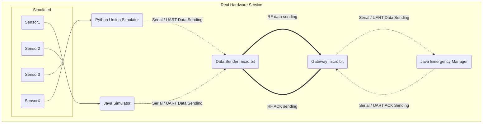

# Projet Scientifique - Partie IoT

```mermaid
graph TB
    
    %% subgraph original [Original Graph]
    %%     %% Lien entre zones
    %%     mb1[micro:bit1 Sensors] <-. Radio Fréquence .-> mb2[micro:bit2 Data Collect]
    %%     simu <-. API .-> em
        
    %%     %% Zone simu
    %%     subgraph one [Simulation]
    %%         mb1 <-- Serial / UART --> py1[Interfacce Python 1]
    %%         py1 <-. API .-> web1((Server Java Simulation))
    %%         subgraph app1 [Appli Simulation]
    %%             web1 <-- VueJS --> wv1[[Simulation View]]
    %%             web1 <-- SpringBoot --> simu{{Simulateur}}
    %%             simu <== SQL ==> bdd1[(Base de Données Simulation)]
    %%         end 
    %%     end

    %%     %% Zone Urgence
    %%     subgraph two [Emergency]
    %%         mb2 <-- Serial / UART --> py2[Interface Python 2]
    %%         subgraph app2 [Appli Emergency]
    %%             web2 <-- VueJS --> wv2[[Emergency View]]
    %%             web2 <-- SpringBoot --> em{{EmergencyManager}}
    %%             em <== SQL ==> bdd2[(Base de Données Emergency)]
    %%         end
    %%         py2 <-. API .-> web2((Server Java Emergency))
    %%         py2 == Liaison Cloud ==> bdd3[(Service de Base De Données)]
    %%         subgraph dashboard [Dashboard]
    %%             bdd3 <== A déterminer ==> db[[Dashboard View]]
    %%         end
    %%     end
    %% end

    subgraph three [Real Hardware Section]
        subgraph virtual [Simulated]
            f1(Sensor1) --- N[ ]:::empty
            f2(Sensor2) --- N
            f3(Sensor3) --- N
            f4(SensorX) --- N
        end

        N --> simuSoft1 & simuSoft2
        simuSoft1(Python Ursina Simulator) -. Serial / UART Data Sending .-> m1(Data Sender micro:bit)
        simuSoft2(Java Simulator) -. Serial / UART Data Sendind .-> m1

        m1 == RF data sending ==> m2(Gateway micro:bit)
        m2 == RF ACK sending ==> m1

        m2 -. Serial / UART Data Sending .-> emerManager(Java Emergency Manager)
        emerManager -. Serial / UART ACK Sending .-> m2
        
    end

    classDef empty width:0px,height:0px;
```
